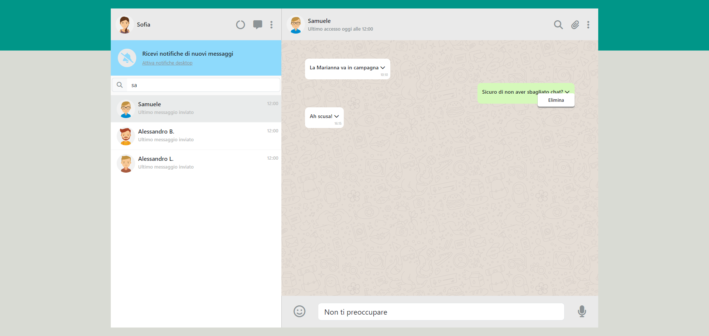

# Boolzapp

- The web app, named "BoolZapp," is a messaging application similar to Whatsapp. It provides a user interface for managing contacts, viewing and sending messages, and interacting with chat elements.

- With this project I learned how to build a responsive and interactive user interface using HTML, CSS, and JavaScript. With Vue.js I created dynamic and reactive components, managing state, and handling events. I used external libraries like Font Awesome and Bootstrap for enhanced design and functionality. Overall, the "BoolZapp" web app showcases a blend of frontend technologies and interactive features.

## Key Features:

- Contacts Management: The app allows users to manage their contacts, view contact information, and initiate new chats.

- Real-time Search: A search input enables users to dynamically filter contacts based on the entered search criteria.

- Chat Interface: The app features a two-pane layout, separating the contacts container and the chat container. The chat container displays messages in a conversation format.

- Message Interaction: Users can send and receive messages, and each message can be deleted, providing a basic form of interaction.

- Vue.js Integration: Vue.js is utilized to manage the state of the application, handle user interactions, and update the UI dynamically.

- Event Handling: The code includes event handling to manage interactions such as clicking on contacts, deleting messages, and handling the display of message options menus.

- Responsive Design: Bootstrap is incorporated to ensure that the app's layout is responsive and adapts to various screen sizes.

- Time Functions: The app includes time-related functions to timestamp messages and simulate delayed message responses.

## Technologies Used:

- HTML5
- CSS3
- Bootstrap
- Font Awesome
- JavaScript
- Vue.js

## ScreenShot

### Milestone 1

- Replica della grafica con la possibilità di avere messaggi scritti dall’utente (verdi) e
  dall’interlocutore (bianco) assegnando due classi CSS diverse
- Visualizzazione dinamica della lista contatti: tramite la direttiva v-for, visualizzare
  nome e immagine di ogni contatto

### Milestone 2

- Visualizzazione dinamica dei messaggi: tramite la direttiva v-for, visualizzare tutti i
  messaggi relativi al contatto attivo all’interno del pannello della conversazione
- Click sul contatto mostra la conversazione del contatto cliccato

### Milestone 3

- Aggiunta di un messaggio: l’utente scrive un testo nella parte bassa e digitando
  “enter” il testo viene aggiunto al thread sopra, come messaggio verde
- Risposta dall’interlocutore: ad ogni inserimento di un messaggio, l’utente riceverà
  un “ok” come risposta, che apparirà dopo 1 secondo.

### Milestone 4

- Ricerca utenti: scrivendo qualcosa nell’input a sinistra, vengono visualizzati solo i
  contatti il cui nome contiene le lettere inserite (es, Marco, Matteo Martina -> Scrivo
  “mar” rimangono solo Marco e Martina)

### Milestone 5 - opzionale

- Cancella messaggio: cliccando sul messaggio appare un menu a tendina che
  permette di cancellare il messaggio selezionato
- Visualizzazione ora e ultimo messaggio inviato/ricevuto nella lista dei contatti

## Svoglimento

### Milestone 1

- Replico la grafica in maniera statica, definendo solo HTML e CSS
- Aggiungo una direttiva v-for per stampare la lista contatti

### Milestone 2

- Aggiungo una funzione che al click mi selezioni la chat desiderata
- Aggiungo una direttiva v-for per stampare i messaggi sulla selezione di una chat

### Milestone 3

- Aggiungo una direttiva v-model all'input
- Creo un nuovo oggetto di appoggio dove salvare i dati di input
- Creo una funzione che copi l'oggetto di appoggio, quest'ultimo lo invio all'array di oggetti principale
- Svuoto l'oggetto di appoggio
- Creo una funzione temporalizzata che viene richiamata all'invio di un messaggio da parte dell'utente.
  - La funzione aggiora un oggetto dichiarato precedentemente con dei nuovi valori per il tempo calcolati al suo interno. Viene avviata dopo 1 secondo

### Milestone 4

- Aggiungo un v-model alla barra di ricerca
- Creo una variabile che prenderà gli input di testo dalla barra di ricerca
- Aggiungo un v-show all'elemento li, rendo il nome dell'oggetto minuscolo, con includes controllo che il testo digitato nella barra di ricerca(anche questo reso in minuscolo) corrisponda al valore della proprietà con chiave name

### Milestone 5
